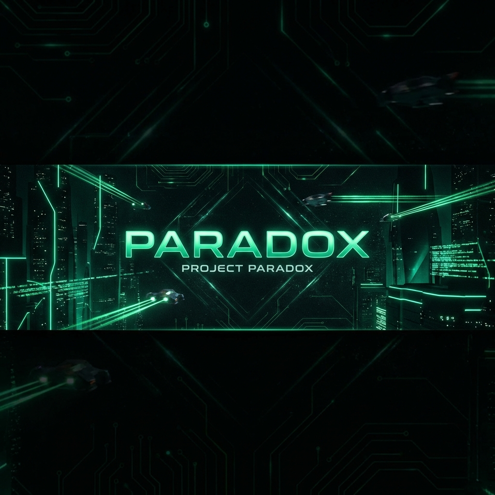

<div align="center">
  <a href="https://i-am-paradox.github.io/aniwebiste">
    
  </a>

  <br />
  <br />

  [](https://i-am-paradox.github.io/aniwebiste)
  [](LICENSE)
  [](https://nextjs.org)

  <h3 align="center">THE SILENT REVOLUTION</h3>
  
  <p align="center">
    High-fidelity audio engineered for the silence. <br />
    <b>A cinematic scrollytelling experience powered by physics.</b>
  </p>

  <br />

  <a href="https://i-am-paradox.github.io/aniwebiste">
    
  </a>
</div>

<br />
<br />

---

## ⚡ System Architecture

> **"We don't sell headphones. We frame silence."**

**Paradox** is not just a landing page. It is a **physics simulation**. We reject standard animations for a custom engine that treats every DOM element as a physical object with weight, inertia, and velocity.

### 🌌 Visual Engine
| Component | Technology | Description |
| :--- | :--- | :--- |
| **Physics** | `Lenis` | Smooth inertia scroll that decouples input from rendering. |
| **Motion** | `Framer Motion` | Velocity-sensitive typography that reacts to scroll speed. |
| **Renderer** | `HTML5 Canvas` | 60FPS image sequence painting for fluid 3D product rotation. |
| **Masking** | `CSS Shaders` | Radial gradients and noise filters for a "film-analog" aesthetic. |

<br />

## 🛠️ Tech Stack ("The Metal")

<div align="center">
  
</div>

-   **Core**: Next.js 15 (App Router)
-   **Language**: TypeScript (Strict Mode)
-   **Styling**: TailwindCSS v4 (Zero-runtime CSS)
-   **Deployment**: GitHub Pages (Static Export)

<br />

## 🚀 Installation Protocols

Initialize the local development environment using the following sequence:

```bash
# 1. Clone the repository
git clone https://github.com/i-am-paradox/aniwebiste.git

# 2. Enter the system
cd aniwebiste

# 3. Install dependencies
npm install

# 4. Ignite the engine
npm run dev
```

<br />

## 📡 Deployment (GitHub Pages)

This system is configured for **Static Export**. To deploy to the `gh-pages` branch:

```bash
npm run deploy
```

> **Note**: The build output is statically generated to `out/` and pushed to the `gh-pages` branch automatically.

<br />

## 🛡️ Digital Signature System (DSS)

This project contains a **Kill-Switch Defense Mechanism**.
-   **Identity Verification**: The `Identity.ts` module generates a cryptographic signature.
-   **Active Defense**: If the signature `PARADOX ARCHITECT` is tampered with, the site's Tech HUD will glitch and fail to render, disabling premium features.

<br />

---

<div align="center">
  <p>ENGINEERED BY PARADOX ARCHITECT</p>
  <p style="opacity: 0.5;">v4.0.12 BUILD</p>
</div>
